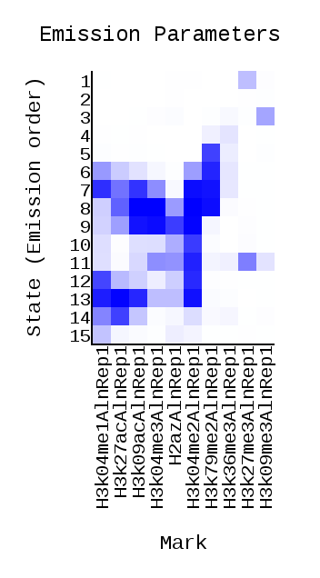
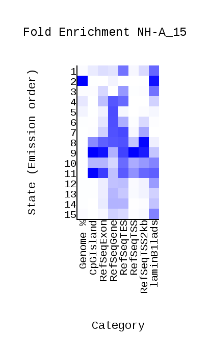
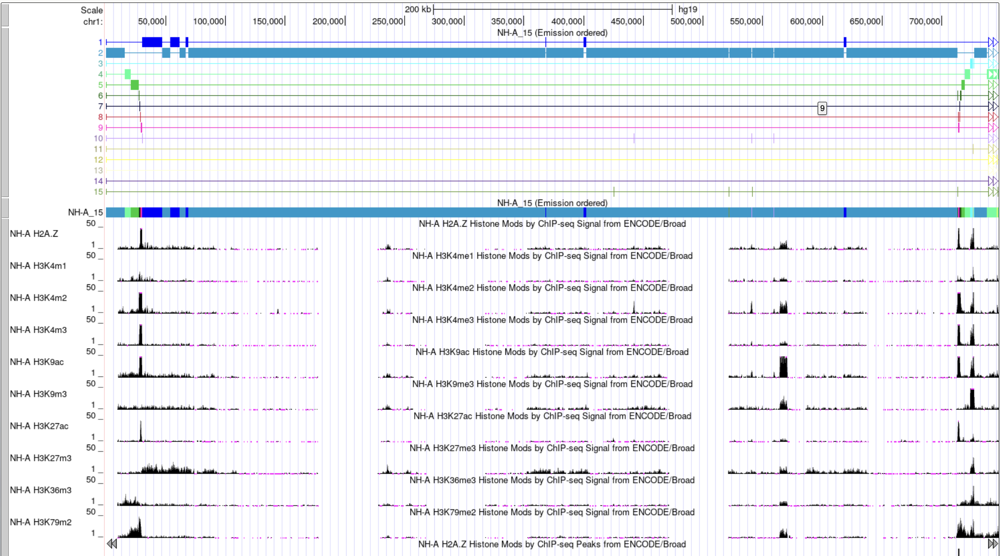

## HSE HW 3 CHROMHMM

Выбранные метки:
- H2az
- H3k27ac
- H3k27me3
- H3k36me3
- H3k04me1
- H3k04me2
- H3k04me3
- H3k79me2
- H3k09ac
- H3k09me3

Ссылка на коллаб: https://colab.research.google.com/drive/1DcQ4nLjgf0alqL8l-Yc07RNowmYEHcgy?usp=sharing
Результаты выполнение коллаба лежат в `/data`

### ChromHMM




### Genome browser



### Анализ
| **Номер состояния** | **Характерные гистоновые модификации** |                   **Расположение**                   |     **Присвоенный тип**    |
|:-------------------:|:--------------------------------------:|:----------------------------------------------------:|:--------------------------:|
|          1          |                H3K27ME3                |          CPG, RefSeqTES, RefSeqTSS2kb, Lamin         |  Inactive/poised Promoter  |
|          2          |                    -                   |                         Lamin                        |       Heterochromatin      |
|          3          |                H3K09ME3                |                         Lamin                        |       Heterochromatin      |
|          4          |           H3K79ME2, H3K36ME3           |           RefSeqExon, RefSeqGene, RefSeqTES          | Transcriptional elongation |
|          5          |                H3K79ME2                |                      RefSeqGene                      | Transcriptional transition |
|          6          |           H3K04ME1, H3K79ME2           |          RefSeqGene, RefSeqTES, RefSeqTSS2kb         |          Enhancer          |
|          7          |  H3K04ME1, H3K09AC, H3K04ME2, H3K79ME2 |                 RefSeqGene, RefSeqTES                | Transcriptional transition |
|          8          |        H3K09AC, H3K4ME3, H3K4ME2       | CPG, RefSeqExon, RefSeqGene, RefSeqTES, RefSeqTSS2kb | Transcriptional transition |
|          9          |     H3K09AC, H3K4ME3, H2AZ, H3K4ME2    |  CPG, RefSeqExon, RefSeqTES, RefSeqTSS, RefSeqTSS2kb |       Active promoter      |
|          10         |                 H3K4ME2                |              RefSeqTES, RefSeqTSS, Lamin             |  Inactive/poised Promoter  |
|          11         |       H3K4ME3, H3K4ME2, H3K27ME3       |                    CPG, RefSeqExon                   |  Inactive/poised Promoter  |
|          12         |            H3K4ME1, H3K04ME2           |                         Lamin                        |      Weak Transcribed      |
|          13         |  H3K04ME1, H3K27AC, H3K09AC, H3K04ME2  |                      RefSeqGene                      |          Enhancer          |
|          14         |       H3K04ME1, H3K27AC, H3KO4ME2      |                 RefSeqGene, RefSeqTES                |          Enhancer          |
|          15         |                H3K04ME1                |                         Lamin                        |       Heterochromatin      |


### Код для бонусной части

```python
states = [
    'Active_Promoter',
    'Weak_Promoter',
    'Inactive/poised_Promoter',
    'Strong_enhancer',
    'Strong_enhancer',
    'Weak/poised_enhancer',
    'Weak/poised_enhancer',
    'Insulator',
    'Transcriptional_transition',
    'Transcriptional_elongation',
    'Weak_transcribed',
    'Polycomb-repressed'
]

with open('NH-A_15_dense.bed', 'r') as input_file:
    with open('NH-A_15_dense_formatted.bed', 'a') as output_file:
        is_first = True

        lines = input_file.readlines()
        for line in lines[1:]:
            if is_first:
                output_file.write(lines[0])
                is_first = True
                continue

            l = line.split('\t')
            l[3] = l[3] + '_' + states[int(l[3]) - 1]

            output_file.write('\t'.join(l))
```